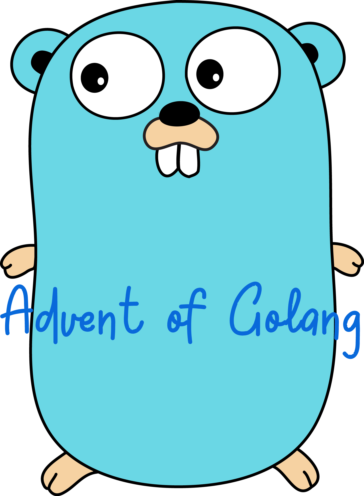

<div align="center">
  
  <h4 align="center">
    Solutions to <a href="https://adventofcode.com">Advent of Code</a> puzzles in Golang.
  </h4>
  <p align="center">
    <a href="https://github.com/atifcppprogrammer/advent-of-golang/blob/master/LICENSE">
      
    </a>
  </p>
</div>

## What is Advent of Code ?
In the event you are not familiar with "Advent of Code", please visit the about page
on their website [here](https://adventofcode.com/2022/about), and [sign up](https://adventofcode.com/2022/auth/login)
for an account before reading further. It should only take a few minutes 👍.

## Development Setup

### Requirements and Initial Setup
To work with this repository, your system should be provisioned with the [latest version](https://go.dev/doc/install) 
of Golang and the [GNU Make](https://www.gnu.org/software/make/) tool. With those
requirements met and the repository cloned please be sure to run the following 
command in the repository's root to complete the initial setup.
```
make
```

### `Makefile` Targets
The `Makefile` in the repository's root provides targets for automating certain
mundane actions. A brief explanation for each such target is provided below.

#### `setup`
This target sets up the git hooks provided in the `.git-hooks` directory and makes
the `init-solution.sh` script executable. Omitting `setup` and just running `make`
as in "Requirements and Initial Setup" section above 👆, results in the same
behaviour.
```
make setup
```

#### `init`
This target creates a [Go module](https://go.dev/blog/using-go-modules) for a single
puzzle's solution. Supposing we are attempting to solve the ["Calorie Counting"](https://adventofcode.com/2022/day/1)
which is the puzzle for day 1 of the year 2022. The following command will create
said Go module with some starter code, and include it in the `go.work` file.
```
make init YEAR=2022 DAY=1 NAME="Calorie Counting" 
```

#### `run`
This target will run your solution against the input provided by Advent of Code for
the puzzle in question, for the "Calorie Counting" puzzle mentioned above 👆 this 
target will be invoked as follows.
```
make run YEAR=2022 DAY=1 PATH="./path/to/adventofcode/puzzle/input.txt"
```

#### `test`
This target will run all provided unit tests for all puzzle solutions and the Go 
modules in `packages` directory.
```
make test
```

#### `format`
This target will format your source code using the `gofmt` tool, normally you would
not need to run this as a git hook is in place to format your code before committing.
```
make format
```

#### `solution`
This target will commit your solution with a pre-defined commit message, this will
ensure that all commits carrying a solution follow a consistent pattern, keeping 
with the "Calorie Counting" example the following command will create the commit 
message `solution: year-2022/01`.
```
make solution YEAR=2022 DAY=1
```
